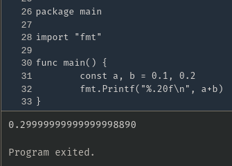

# Pismo - Rotina de Transações

## Index

- [Executando](#executando)
  * [Variáveis de ambiente](#variáveis-de-ambiente)
  * [Makefile](#makefile)
  * [Prefiro eu mesmo fazer](#prefiro-eu-mesmo-fazer)
  * [Utilizando as APIs](#utilizando-as-apis)
- [Testes](#testes)
  * [Integração com Banco Postgres](#integração-com-db)
  * [Unitários](#unitários)
- [Arquitetura](#arquitetura)
- [Tecnologias usadas](#tecnologias-usadas)
- [Escolhas técnicas](#escolhas-técnicas)
    * [Hexagonal](#hexagonal)
    * [Microservices](#microservice)
    * [Api-Gateway](#api-gateway)
    * [Dinheiro do tipo...INTEGER!](#dinheiro-do-tipointeger)
    * [Event-Driven](#event-driven)

## Executando

### Variáveis de ambiente

Certifique-se que as variáveis de ambiente utilizadas, especialmente aquelas que dizem respeito às portas, não irão conflitar com algum outro serviço da sua máquina.
os arquivos podem ser encontrados em:
`services/*/.env`.


### Makefile

O comando abaixo irá subir todos os serviços _docker_ necessários:
```bash
make up-all
```
### Prefiro eu mesmo fazer

Caso prefira subir o ambiente sem o _Makefile_ acima:
```bash
docker network create internal-net
docker compose up -d --scale kafkaui=0 --scale db-test=0
```
Dessa forma, a rede docker que o projeto necessita será criada e o container do [kafka-ui](https://github.com/provectus/kafka-ui) e do banco de teste serão ignorados, uma vez que estão presentes no projeto apenas para **acompanhamento** do fluxo de eventos e para a execução dos testes de integração.

### Utilizando as APIs

Você pode importar a _collection_ do Insomnia localizado neste repositório ou utilizar os comandos abaixo direto no terminal.
**Necessita de curl instalado!**

#### Criando _account_

```bash
curl --request POST \
  --url http://localhost:8080/v1/accounts \
  --header 'Content-Type: application/json' \
  --data '{
	"documentNumber": "12348378734"
}'
```

#### Buscando _account_ por _id_

```bash
curl --request GET \
  --url http://localhost:8080/v1/accounts/seu-uuid-aqui
```

#### Criando _transaction_ para _account_

```bash
curl --request POST \
  --url http://localhost:8080/v1/transactions \
  --header 'Content-Type: application/json' \
  --data '{
	"accountId": "seu-uuid-aqui",
	"operationTypeId": 1,
	"amount": -5.00
}'
```


## Testes:

### Integração com db:
```bash
make run-db-tests
```

### Unitários:
```bash
make run-unit-tests
```

## Arquitetura


## Tecnologias usadas
- Docker
- Golang (1.20)
- Kafka
- Postgres
- Krakend API-Gateway
- sqlc + pgx/v5
- gomock(uber)

## Escolhas técnicas

### Hexagonal
Este _design_ de arquitetura nos ajuda com a testabilidade e flexibilidade da nossa aplicação, possibilitando uma atenção maior
 ao seu domínio sem preocupações com o que está fora dele.
 
### Microservice

Arquitetura escolhida pela escabilidade, modularidade, elasticidade, tolerância a falhas, testabilidade e confiabilidade.

### Api-Gateway

Uma Api-Gateway entrega muitas vantagens, neste pequeno projeto serve para direcionar as _requests_ para o _microservice_ adequado.

### Dinheiro do tipo...INTEGER!

Como estamos lidando com real e centavos (ou quaisquer que sejam os equivalentes), e eles geralmente são representados por um número decimal, pode parecer óbvio usar float ou decimal, pois eles são projetados para representar números que incluem casas decimais. No entanto, se você entender um pouco sobre como float funciona no nível do hardware, verá por que essa não é a melhor abordagem.



Você pode rodar o exemplo [aqui](https://go.dev/play/p/IrhUSV1CZGC) e também ler mais informações neste ótimo [artigo](https://blog.codeminer42.com/be-cool-dont-use-float-double-for-storing-monetary-values).

### Event-Driven
Trabalhar com _microservices_ pode ser muito complexo dependendo do domínio da aplicação. Um dos grandes problemas desta arquitetura são as chamadas síncronas entre serviços, que podem gerar lentidão no sistema como um todo ou folharem devido a problemas de rede. Event-Driven é descrito por Mark Richards e Neal Ford em [Fundamentals of Software Architecture: An Engineering Approach](https://www.goodreads.com/book/show/44144493-fundamentals-of-software-architecture) como uma `arquitetura`. Nesta arquitetura, cada ação gera um evento e este será usado por outra ação que também irá gerar um evento e assim por diante.</p>

Devido a esta característica, _microservices_ "casam" bem como uma arquitetura baseada em eventos, pois os erros de rede são drasticamente diminuídos e tudo acontece de forma assíncrona.
</p>
