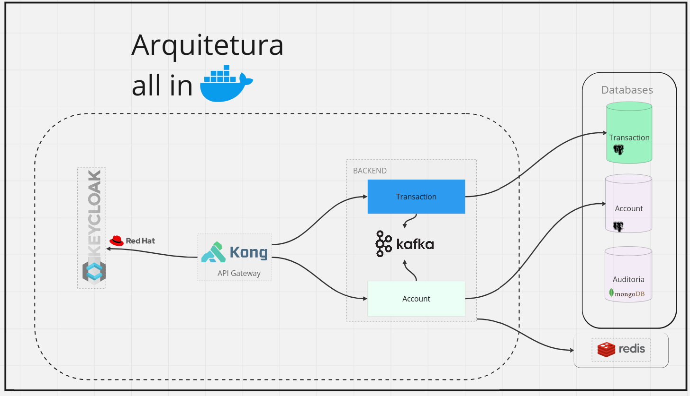

# Título

## ordem de prioridade:
    - Adicionar balance no account + mapper do Balance [x]
    - Criar transaction microservice [x]
    - Adicionar kafka [x]
    - Testes + validações de negócio (se vai ser + ou - o amount etc)
        - cpf cnpj regex
    - Swagger
    - Adicionar collection do insomnia
    - Criar auth com jwt
    - Criar interface pro producer kafka/qualquer outro

### Tecnologias usadas:
- Docker
- Golang
- Kafka
- Postgres
- Krakend API-Gateway
- sqlc

## Subindo o ambiente:

Crie a rede para o docker:
```bash
docker network create internal-net
```

Inicie o ambiente com:
```bash
docker-compose up -d
```
ou:
```bash
docker compose up -d
```

### Escolhas técnicas:
- Microservices: arquitetura escolhida pela escabilidade, modularidade, elasticidade, tolerância a falhas e confiabilidade.

- Krakend API-Gateway: direcionará as <em>requests</em> para o microservice adequado. 
- Event-Driven: ...

### Testes:
- Testes de repo: rodar o banco de testes e garantir que as var do dockercompose estejam corretas no código

# Arquitetura


